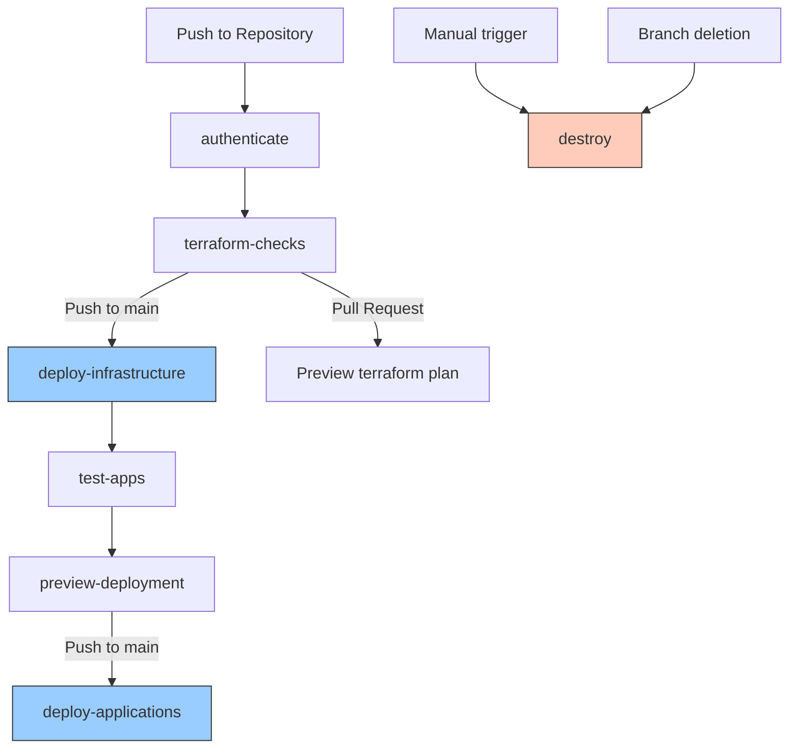

# GKE Terraform Project

This repository contains Terraform configurations to provision and manage Google Kubernetes Engine (GKE) infrastructure on Google Cloud Platform (GCP).

## Project Description

This project automates the deployment of GKE clusters and related infrastructure using Terraform and GitHub Actions. It provides a complete CI/CD pipeline for infrastructure provisioning, application deployment, and resource cleanup.

## Prerequisites

- Google Cloud Platform (GCP) account
- GitHub account
- `gcloud` CLI installed locally (for initial setup)
- Terraform knowledge (for customization)
- GitHub repository access and permissions to configure secrets

## Infrastructure Setup

### Setting up Workload Identity Federation for GitHub Actions

To allow GitHub Actions to authenticate with GCP without using static credentials, follow these steps to set up Workload Identity Federation:

```bash
# 1. Set environment variables
export PROJECT_ID="your-gcp-project-id"
export POOL_NAME="github-actions-pool"
export PROVIDER_NAME="github-provider"
export SERVICE_ACCOUNT_NAME="github-gke-terraform"
export REPO_NAME="ahmedabdelkhalek1/gke-terraform"

# 2. Create a Workload Identity Pool
gcloud iam workload-identity-pools create ${POOL_NAME} \
    --project=${PROJECT_ID} \
    --location="global" \
    --display-name="GitHub Actions Pool"

# 3. Get the Workload Identity Pool ID
export POOL_ID=$(gcloud iam workload-identity-pools describe ${POOL_NAME} \
    --project=${PROJECT_ID} \
    --location="global" \
    --format="value(name)")

# 4. Create a Workload Identity Provider in the pool
gcloud iam workload-identity-pools providers create-oidc ${PROVIDER_NAME} \
    --project=${PROJECT_ID} \
    --location="global" \
    --workload-identity-pool=${POOL_NAME} \
    --display-name="GitHub provider" \
    --attribute-mapping="google.subject=assertion.sub,attribute.actor=assertion.actor,attribute.repository=assertion.repository" \
    --issuer-uri="https://token.actions.githubusercontent.com"

# 5. Create a Service Account for GitHub Actions
gcloud iam service-accounts create ${SERVICE_ACCOUNT_NAME} \
    --project=${PROJECT_ID} \
    --description="Service Account for GitHub Actions to deploy GKE infrastructure" \
    --display-name="GitHub GKE Terraform SA"

# 6. Grant necessary IAM roles to the Service Account
# For Terraform to manage GCP resources
gcloud projects add-iam-policy-binding ${PROJECT_ID} \
    --member="serviceAccount:${SERVICE_ACCOUNT_NAME}@${PROJECT_ID}.iam.gserviceaccount.com" \
    --role="roles/container.admin"

gcloud projects add-iam-policy-binding ${PROJECT_ID} \
    --member="serviceAccount:${SERVICE_ACCOUNT_NAME}@${PROJECT_ID}.iam.gserviceaccount.com" \
    --role="roles/compute.admin"

gcloud projects add-iam-policy-binding ${PROJECT_ID} \
    --member="serviceAccount:${SERVICE_ACCOUNT_NAME}@${PROJECT_ID}.iam.gserviceaccount.com" \
    --role="roles/iam.serviceAccountUser"

gcloud projects add-iam-policy-binding ${PROJECT_ID} \
    --member="serviceAccount:${SERVICE_ACCOUNT_NAME}@${PROJECT_ID}.iam.gserviceaccount.com" \
    --role="roles/storage.admin"

# 7. Allow the GitHub Actions workflow to impersonate the Service Account
gcloud iam service-accounts add-iam-policy-binding \
    ${SERVICE_ACCOUNT_NAME}@${PROJECT_ID}.iam.gserviceaccount.com \
    --project=${PROJECT_ID} \
    --role="roles/iam.workloadIdentityUser" \
    --member="principalSet://iam.googleapis.com/${POOL_ID}/attribute.repository/${REPO_NAME}"

# 8. Get the Workload Identity Provider resource name
export WORKLOAD_IDENTITY_PROVIDER=$(gcloud iam workload-identity-pools providers describe ${PROVIDER_NAME} \
    --project=${PROJECT_ID} \
    --location="global" \
    --workload-identity-pool=${POOL_NAME} \
    --format="value(name)")

echo "Workload Identity Provider: ${WORKLOAD_IDENTITY_PROVIDER}"
echo "Service Account Email: ${SERVICE_ACCOUNT_NAME}@${PROJECT_ID}.iam.gserviceaccount.com"
```

Add these values as GitHub repository secrets:
- `WORKLOAD_IDENTITY_PROVIDER`: The provider ID from the output above
- `SERVICE_ACCOUNT`: The service account email from the output above
- `PROJECT_ID`: Your GCP project ID

## Modules Overview

### 1. VPC Module

**Purpose**: Creates a Virtual Private Cloud (VPC) network and subnets for the GKE cluster.

**Usage**:
```hcl
module "vpc" {
  source       = "./modules/vpc"
  project_id   = var.project_id
  region       = var.region
  network_name = var.network_name
}
```

**Principal Resources**:
- `google_compute_network`: Creates the VPC network
- `google_compute_subnetwork`: Creates subnets within the VPC
- `google_compute_router`: Sets up Cloud Router for NAT
- `google_compute_router_nat`: Configures Cloud NAT for outbound connectivity

### 2. GKE Module

**Purpose**: Provisions a Google Kubernetes Engine cluster and node pools.

**Usage**:
```hcl
module "gke" {
  source                   = "./modules/gke"
  project_id               = var.project_id
  region                   = var.region
  network                  = module.vpc.network_name
  subnetwork               = module.vpc.subnet_name
  cluster_name             = var.cluster_name
  kubernetes_version       = var.kubernetes_version
  node_pool_machine_type   = var.node_pool_machine_type
  node_pool_min_count      = var.node_pool_min_count
  node_pool_max_count      = var.node_pool_max_count
  node_pool_disk_size_gb   = var.node_pool_disk_size_gb
  node_pool_service_account = var.node_pool_service_account
}
```

**Principal Resources**:
- `google_container_cluster`: Creates the GKE cluster
- `google_container_node_pool`: Creates the node pools for the cluster
- `google_service_account`: Creates service accounts for GKE nodes

### 3. Kubernetes Applications Module

**Purpose**: Deploys applications to the GKE cluster using Kubernetes manifests.

**Usage**:
```hcl
module "applications" {
  source        = "./modules/applications"
  project_id    = var.project_id
  region        = var.region
  cluster_name  = module.gke.cluster_name
  depends_on    = [module.gke]
}
```

**Principal Resources**:
- `kubernetes_namespace`: Creates namespaces for applications
- `kubernetes_deployment`: Deploys application workloads
- `kubernetes_service`: Exposes applications internally or externally
- `kubernetes_ingress`: Configures ingress rules for external access

## Variables & Outputs

### Variables

| Variable Name | Type | Default | Description | Required By Module(s) |
|---------------|------|---------|-------------|----------------------|
| project_id | string | - | GCP Project ID | vpc, gke, applications |
| region | string | "us-central1" | GCP Region for resources | vpc, gke, applications |
| zone | string | "us-central1-a" | GCP Zone for zonal resources | gke |
| network_name | string | "gke-network" | Name for the VPC network | vpc |
| subnet_name | string | "gke-subnet" | Name for the subnet | vpc |
| subnet_cidr | string | "10.0.0.0/24" | CIDR range for the subnet | vpc |
| cluster_name | string | "gke-cluster" | Name for the GKE cluster | gke |
| kubernetes_version | string | "1.24" | Kubernetes version for GKE | gke |
| node_pool_machine_type | string | "e2-medium" | Machine type for GKE nodes | gke |
| node_pool_min_count | number | 1 | Minimum number of nodes per zone | gke |
| node_pool_max_count | number | 3 | Maximum number of nodes per zone | gke |
| node_pool_disk_size_gb | number | 100 | Disk size for each node in GB | gke |
| node_pool_service_account | string | "" | Service account for node pool (optional) | gke |

### Outputs

| Output Name | Value Expression | Description |
|-------------|------------------|-------------|
| network_name | module.vpc.network_name | Name of the created VPC network |
| subnet_name | module.vpc.subnet_name | Name of the created subnet |
| cluster_name | module.gke.cluster_name | Name of the created GKE cluster |
| cluster_endpoint | module.gke.cluster_endpoint | Endpoint for the GKE cluster |
| cluster_ca_certificate | module.gke.cluster_ca_certificate | CA certificate for the GKE cluster |
| kubeconfig_path | module.gke.kubeconfig_path | Path to the generated kubeconfig file |

## Pipeline Usage

The repository includes GitHub Actions workflows to automate infrastructure deployment and application management.

### Workflow Jobs

#### 1. authenticate

**Purpose**: Authenticates with Google Cloud using Workload Identity Federation.  
**Trigger**: Runs at the start of every workflow.  
**Critical Steps**:
- Uses `google-github-actions/auth` to authenticate with GCP using Workload Identity Federation
- Sets up Google Cloud SDK for subsequent jobs

```yaml
authenticate:
  runs-on: ubuntu-latest
  steps:
    - uses: actions/checkout@v3
    - id: auth
      uses: google-github-actions/auth@v1
      with:
        workload_identity_provider: ${{ secrets.WORKLOAD_IDENTITY_PROVIDER }}
        service_account: ${{ secrets.SERVICE_ACCOUNT }}
    - name: Set up Cloud SDK
      uses: google-github-actions/setup-gcloud@v1
```

#### 2. terraform-checks

**Purpose**: Validates Terraform configurations and runs a plan to preview changes.  
**Trigger**: Runs after successful authentication.  
**Critical Steps**:
- Sets up Terraform CLI
- Initializes Terraform with backend configuration
- Validates Terraform configuration files
- Runs Terraform plan to preview changes

```yaml
terraform-checks:
  needs: authenticate
  runs-on: ubuntu-latest
  steps:
    - uses: actions/checkout@v3
    - uses: hashicorp/setup-terraform@v2
    - name: Terraform Init
      run: terraform init
    - name: Terraform Validate
      run: terraform validate
    - name: Terraform Plan
      run: terraform plan -var="project_id=${{ secrets.PROJECT_ID }}"
```

#### 3. deploy-infrastructure

**Purpose**: Applies Terraform configurations to provision infrastructure.  
**Trigger**: Runs after successful terraform-checks on push to main branch.  
**Critical Steps**:
- Sets up Terraform CLI
- Initializes Terraform backend
- Applies Terraform configuration to create GCP resources
- Outputs information about created resources

```yaml
deploy-infrastructure:
  needs: terraform-checks
  if: github.ref == 'refs/heads/main'
  runs-on: ubuntu-latest
  steps:
    - uses: actions/checkout@v3
    - uses: hashicorp/setup-terraform@v2
    - name: Terraform Init
      run: terraform init
    - name: Terraform Apply
      run: terraform apply -auto-approve -var="project_id=${{ secrets.PROJECT_ID }}"
```

#### 4. test-apps

**Purpose**: Runs tests against the application manifests.  
**Trigger**: Runs after successful infrastructure deployment.  
**Critical Steps**:
- Gets GKE credentials to connect to the cluster
- Validates Kubernetes manifests
- Runs integration tests if applicable

```yaml
test-apps:
  needs: deploy-infrastructure
  runs-on: ubuntu-latest
  steps:
    - uses: actions/checkout@v3
    - name: Get GKE credentials
      uses: google-github-actions/get-gke-credentials@v1
      with:
        cluster_name: ${{ needs.deploy-infrastructure.outputs.cluster_name }}
        location: ${{ vars.REGION }}
    - name: Validate Kubernetes manifests
      run: |
        kubectl apply --dry-run=client -f kubernetes/
```

#### 5. preview-deployment

**Purpose**: Creates a preview of the application deployment.  
**Trigger**: Runs after successful tests.  
**Critical Steps**:
- Gets GKE credentials
- Creates a preview namespace
- Deploys applications to the preview namespace
- Outputs access URLs for preview environment

```yaml
preview-deployment:
  needs: test-apps
  runs-on: ubuntu-latest
  steps:
    - uses: actions/checkout@v3
    - name: Get GKE credentials
      uses: google-github-actions/get-gke-credentials@v1
      with:
        cluster_name: ${{ needs.deploy-infrastructure.outputs.cluster_name }}
        location: ${{ vars.REGION }}
    - name: Deploy to preview namespace
      run: |
        kubectl create namespace preview-${{ github.run_id }} --dry-run=client -o yaml | kubectl apply -f -
        kubectl -n preview-${{ github.run_id }} apply -f kubernetes/
```

#### 6. deploy-applications

**Purpose**: Deploys applications to the production namespace.  
**Trigger**: Runs after successful preview on push to main branch.  
**Critical Steps**:
- Gets GKE credentials
- Creates production namespace if it doesn't exist
- Deploys applications to the production namespace
- Verifies deployment status

```yaml
deploy-applications:
  needs: preview-deployment
  if: github.ref == 'refs/heads/main'
  runs-on: ubuntu-latest
  steps:
    - uses: actions/checkout@v3
    - name: Get GKE credentials
      uses: google-github-actions/get-gke-credentials@v1
      with:
        cluster_name: ${{ needs.deploy-infrastructure.outputs.cluster_name }}
        location: ${{ vars.REGION }}
    - name: Deploy to production
      run: |
        kubectl create namespace production --dry-run=client -o yaml | kubectl apply -f -
        kubectl -n production apply -f kubernetes/
        kubectl -n production rollout status deployment --timeout=2m
```

#### 7. destroy

**Purpose**: Destroys all infrastructure created by Terraform.  
**Trigger**: Manual workflow dispatch or branch deletion.  
**Critical Steps**:
- Sets up Terraform CLI
- Initializes Terraform backend
- Destroys all resources created by Terraform

```yaml
destroy:
  runs-on: ubuntu-latest
  steps:
    - uses: actions/checkout@v3
    - id: auth
      uses: google-github-actions/auth@v1
      with:
        workload_identity_provider: ${{ secrets.WORKLOAD_IDENTITY_PROVIDER }}
        service_account: ${{ secrets.SERVICE_ACCOUNT }}
    - name: Set up Cloud SDK
      uses: google-github-actions/setup-gcloud@v1
    - uses: hashicorp/setup-terraform@v2
    - name: Terraform Init
      run: terraform init
    - name: Terraform Destroy
      run: terraform destroy -auto-approve -var="project_id=${{ secrets.PROJECT_ID }}"
```

## CI/CD Pipeline Flow Chart



## Cleanup & Unlock Procedures

### When to Run the Destroy Pipeline

Run the destroy pipeline in the following scenarios:

1. **Feature Branch Cleanup**: After merging or closing a feature branch that had its own environment.
2. **End-of-Life**: When a project or environment is no longer needed.
3. **Cost Optimization**: To avoid unnecessary costs during periods of inactivity.
4. **Environment Reset**: When you need to completely rebuild an environment from scratch.
5. **Troubleshooting**: When facing issues that require a fresh start.

To trigger destruction:
- Go to the Actions tab in your GitHub repository
- Select the "Destroy Infrastructure" workflow
- Click "Run workflow" and select the appropriate branch
- Confirm the action

### Unlocking Terraform State

Terraform state locks prevent concurrent operations that could corrupt your infrastructure state. If a process terminates unexpectedly, the lock might remain.

**When to unlock Terraform state**:
- After a failed `terraform apply` that leaves the state locked
- When you see error messages about the state being locked
- When a CI/CD pipeline job fails unexpectedly during Terraform operations

**How to unlock Terraform state**:

If using Google Cloud Storage as the backend:

```bash
# 1. Identify the lock ID
gsutil cat gs://<bucket-name>/terraform/state/default.tflock

# 2. Force unlock using the lock ID
terraform force-unlock <LOCK_ID>
```

If using other backends, consult the relevant documentation for unlocking procedures.

**CAUTION**: Only force-unlock when you're certain no other Terraform operations are in progress. Improper unlocking can lead to state corruption.

## Additional Resources

- [Terraform Documentation](https://www.terraform.io/docs)
- [Google Kubernetes Engine Documentation](https://cloud.google.com/kubernetes-engine/docs)
- [GitHub Actions Documentation](https://docs.github.com/en/actions)