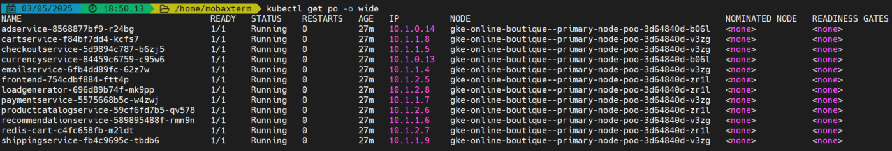

# GKE Demo with Terraform

[](https://github.com/cvitaa11/gke-demo/actions/workflows/main.yml)

This repository contains Terraform configurations to deploy a Google Kubernetes Engine (GKE) cluster with custom networking settings.

## 1. Introduction

This project contains Terraform configurations to deploy a Google Kubernetes Engine (GKE) cluster with custom networking settings.

### Prerequisites

- Google Cloud Platform (GCP) Account
- Google Cloud SDK installed
- Terraform installed
- GCP Project with required APIs enabled:
  - Compute Engine API
  - Kubernetes Engine API
  - Cloud Resource Manager API

## 2. Architecture and Network Configuration

The cluster is configured with the following IP ranges:

| Component | IP Range      |
|-----------|---------------|
| Nodes     | 10.0.0.0/16   |
| Pods      | 10.1.0.0/16   |
| Services  | 10.2.0.0/16   |

### Network Setup

The project creates a custom VPC network and subnet with secondary IP ranges for pods and services. This enables VPC-native routing for the GKE cluster.

### Existing Network Screenshots

Pods CIDR Range:  
  

Services CIDR Range:  
  

### Suggested Additional Screenshots

- **Terraform Plan Output:** Screenshot of the terminal showing `terraform plan` output before applying changes. Place this in the Usage section before deployment steps.
- **GKE Cluster Dashboard:** Screenshot of the GKE cluster overview page in the GCP Console. Place this in the Architecture section to visualize the cluster.
- **Kubectl Nodes and Pods:** Screenshot of `kubectl get nodes` and `kubectl get pods --all-namespaces` outputs. Place this in the Usage section after deployment.
- **Network Topology Diagram:** A simple diagram showing the VPC, subnet, and cluster networking. Place this in the Architecture section.

## 3. Terraform Modules and Resources

### Main Module Overview

The project uses a Terraform module located in `infra/modules/gke` to encapsulate the GKE cluster setup. The module provisions the cluster, node pools, and networking resources.

### Module Input Variables

| Name           | Description                      | Type          | Default           | Required |
|----------------|--------------------------------|---------------|-------------------|:--------:|
| project_id     | GCP project id                 | string        | n/a               | Yes      |
| region         | Region                        | string        | us-east1          | No       |
| node_locations | Availability zones of the GKE nodes | list(string) | n/a               | Yes      |
| node_ip_range  | IP address range of GKE nodes | string        | 10.0.0.0/16      | No       |
| pod_ip_range   | IP address range of Kubernetes pods | string    | 10.1.0.0/16      | No       |
| service_ip_range | IP address range of Kubernetes services | string | 10.2.0.0/16      | No       |
| version_prefix | Kubernetes engine version prefix | string      | n/a               | No       |
| machine_type   | Node instance category         | string        | n/a               | No       |
| cluster_name   | GKE cluster name              | string        | online-boutique-demo | No     |

### Module Outputs

| Name                   | Description                      |
|------------------------|--------------------------------|
| region                 | GCloud Region                   |
| kubernetes_cluster_name | GKE Cluster Name               |
| kubernetes_cluster_host | GKE Cluster Host               |
| cluster_ca_certificate | Base64 encoded cluster CA certificate |
| client_certificate     | Base64 encoded client certificate |
| client_key             | Base64 encoded client key      |

### Node Pool Configuration

The node pool is configured with the following settings:

- 3 nodes per zone
- Machine type specified by `machine_type` variable
- Disk size: 30GB standard persistent disk
- OAuth scopes for logging, monitoring, and storage read-only
- Node labels include the project ID as environment
- Metadata disables legacy endpoints for security

## 4. Usage and Deployment

Follow these steps to deploy the GKE cluster:

1. Clone the repository:
   ```bash
   git clone https://github.com/cvitaa11/gke-demo.git
   cd gke-demo/infra/example
   ```
2. Create a `terraform.tfvars` file with your project settings:
   ```bash
   project_id     = "your-project-id"
   region         = "your-desired-region"
   node_locations = ["your-desired-AZs"]
   ```
3. Initialize Terraform:
   ```bash
   terraform init
   ```
4. Review the plan:
   ```bash
   terraform plan
   ```
   _Consider adding a screenshot of this output here._
5. Apply the configuration:
   ```bash
   terraform apply
   ```
6. Configure kubectl to access the cluster:
   ```bash
   gcloud container clusters get-credentials $(terraform output -raw kubernetes_cluster_name) --region $(terraform output -raw region)
   ```
   _Consider adding a screenshot of `kubectl get nodes` output here._

## 5. Cleanup and Notes

To destroy the created resources, run:

```bash
terraform destroy
```

Notes:

- The configuration uses minimal resources to stay within GCP's free tier.
- The cluster is deployed in a single zone for cost optimization.
- Monitor your GCP usage and costs carefully.

## 6. Appendices

You may add additional screenshots or diagrams here as needed.
